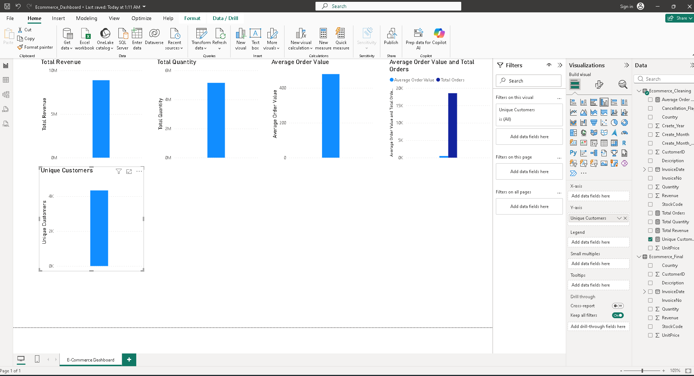

# E-Commerce Sales Performance Dashboard

## Project Overview
An interactive Power BI dashboard built to analyze transaction data, track overall revenue performance, monitor sales trends over time, and identify top-performing products and regional markets.



---

## Key Metrics (KPIs)
* **Total Revenue**: $8.89M
* **Total Quantity Sold**
* **Total Orders**
* **Unique Customers**

---

## DAX Measures
```dax
Total Revenue = SUM(Ecommerce_Cleaning[Revenue])

Total Quantity = SUM(Ecommerce_Cleaning[Quantity])

Total Orders = DISTINCTCOUNT(Ecommerce_Cleaning[InvoiceNo])

Unique Customers = DISTINCTCOUNT(Ecommerce_Cleaning[CustomerID])

Average Order Value = DIVIDE([Total Revenue], [Total Orders], 0)
